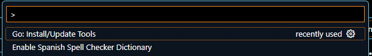
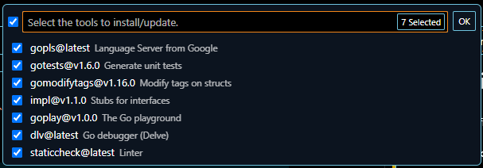
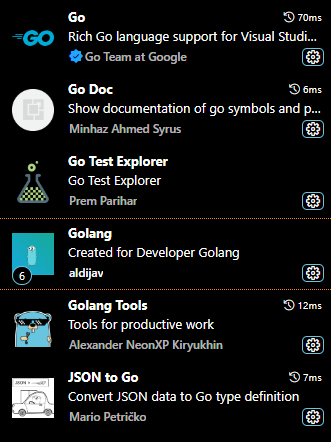

# Getting Started Visual Studio

create a file .go, you can use the file created in the [Getting Started](getting-started.md)

press f1 key and select GO:install/Update Tools

some extention recomended

